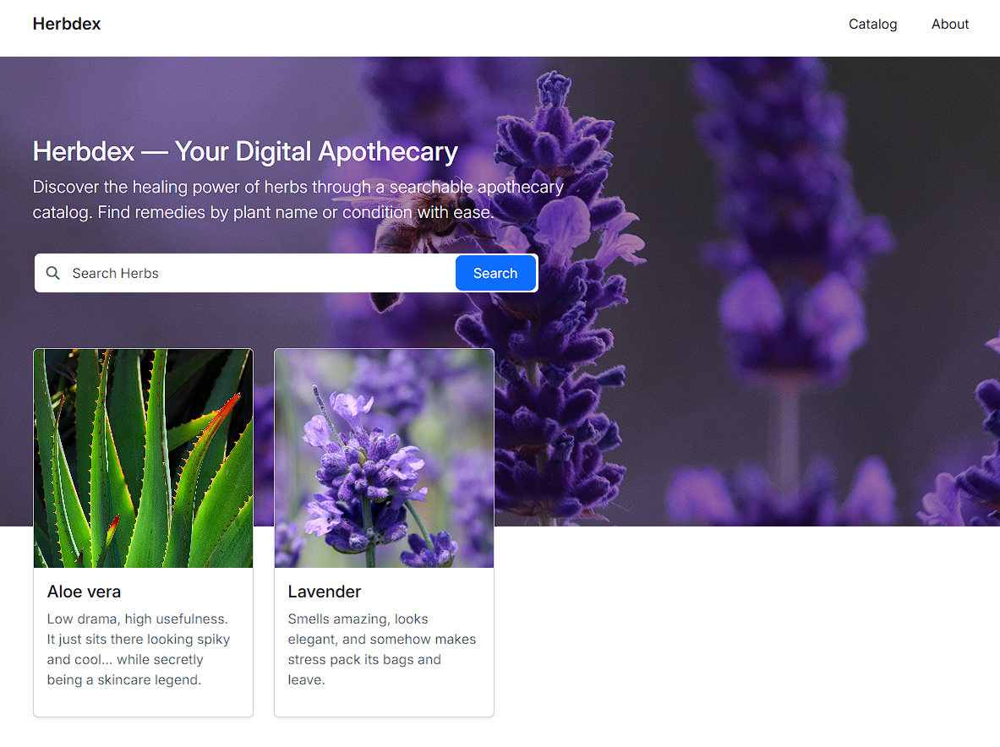

# 🌿 HerbDex

Django-powered herbal apothecary web application.

Search medicinal herbs by **name** or by **illness / medical use**, with a clean and simple Bootstrap interface.

## Screenshot

<div align="center">
  <p float="left">
    
  </p>
</div>

## Architecture

- 🐍 **Backend** → Django
- 🐘 **Database** → PostgreSQL
- 🎨 **Frontend UI** → Bootstrap

## Getting Started

### 1️⃣ Clone the repository

```bash
git clone https://github.com/AppRonin/herbdex-django.git
cd herbdex-django
```

### 2️⃣ Create Virtual Environment

```bash
python -m venv venv
source venv/bin/activate
```

### 3️⃣ Install Dependencies

```bash
pip install -r requirements.txt
```

### 4️⃣ Environment Variables Setup

```bash
SECRET_KEY=your-secret-key
DEBUG=True

DB_NAME=herbdex_db
DB_USER=postgres
DB_PASSWORD=yourpassword
DB_HOST=localhost
```

### 5️⃣ Run Development Server

```bash
python manage.py runserver
```

## Author

Developed by **AppRonin**, Full-Stack Developer.
